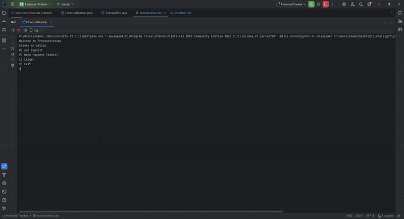

# Financial Tracker

## Description of the Project

The Financial Tracker Application allows users to record, manage, and review their financial transactions.
The purpose of this application is to help users track their income and expenses by adding deposits, recording payments, and showing reports over specific time periods.
The intended users for this application are individual users that want to keep track of their expenses.

The Main function of this application:

- Add a deposit
- Make a payment
- View your ledger with filters 
  - View your deposits 
  - View your payments
- View your reports (Filter your reports)
  - Month to date
  - Previous Month
  - Year to date
  - Previous Year
  - Specific vendor
  - Custom Search

This program aims to solve the problem of manually tracking your financial records by providing an organized interface where users can input and analyze their spending patterns easily.

## User Stories

- As a user, I want to view all my transactions in a ledger, so that I can review my financial activity in order.
- As a user, I want to make a new deposit, so that I can keep track of all deposits.
- As a user, I want to make a new payment, so that I can keep track of all of my payments.
- As a user, I want to view all of my reports based on the date, so that I can filter my transactions.
- As a user, I want to be able to create a custom search, so that I can filter my transactions.
- As a user, I want to view all of my transactions in a well organized and latest to oldest transactions, so that it is easier to read my transactions.

## Setup

1. Create a new project on intelliJ
2. create 2 classes (FinancialTracker and Transaction)
3. insert the transactions.csv file
4. copy and paste the code for FinancialTracker and Transaction class

### Prerequisites

- IntelliJ IDEA: Ensure you have IntelliJ IDEA installed, which you can download from [here](https://www.jetbrains.com/idea/download/).
- Java SDK: Make sure Java SDK is installed and configured in IntelliJ.

### Running the Application in IntelliJ

Follow these steps to get your application running within IntelliJ IDEA:

1. Open IntelliJ IDEA.
2. Select "Open" and navigate to the directory where you cloned or downloaded the project.
3. After the project opens, wait for IntelliJ to index the files and set up the project.
4. Find the main class with the `public static void main(String[] args)` method.
5. Right-click on the file and select 'Run 'YourMainClassName.main()'' to start the application.

## Technologies Used

- Java 17
- Any additional libraries or frameworks used in the project.

## Demo

- 

## Future Work

- Add a monthly / yearly summary report that shows net income, average expense, etc.
- Support for recurring transactions (auto-insert rent, subscriptions, payroll).

## Resources

- [java cheatsheet](https://quickref.me/java)
- [Dates and Times](https://docs.oracle.com/javase/8/docs/api/java/time/LocalDate.html)

## Team Members

- 

## Thanks

- Thank you to Raymond Maroun for helping me with multiple parts of my code.
